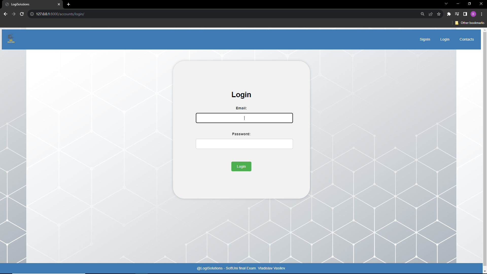
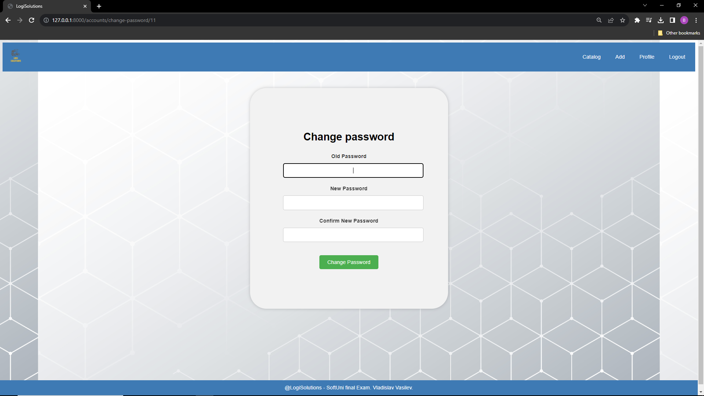
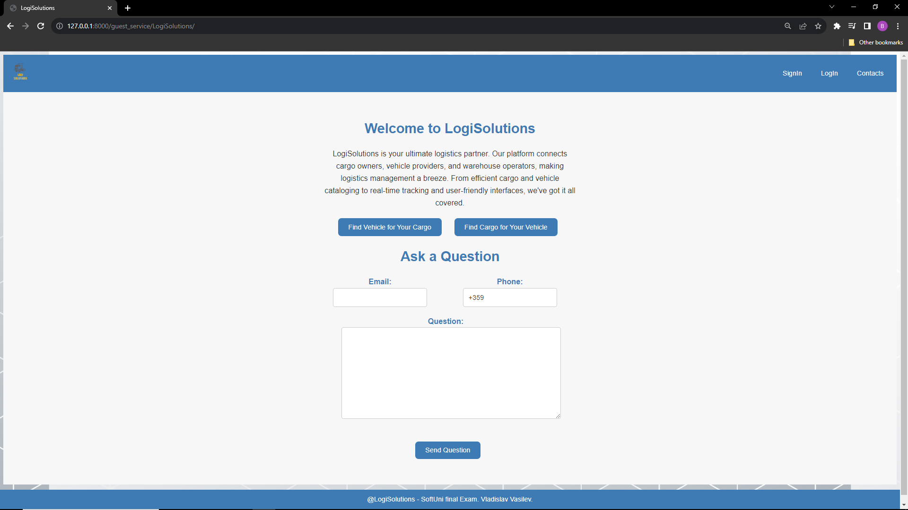
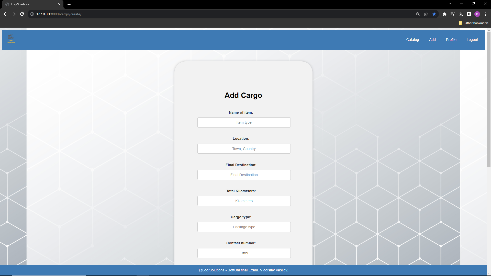
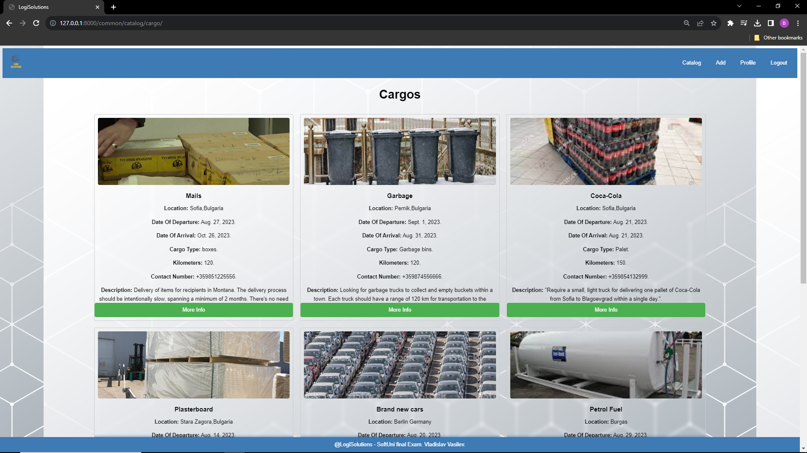
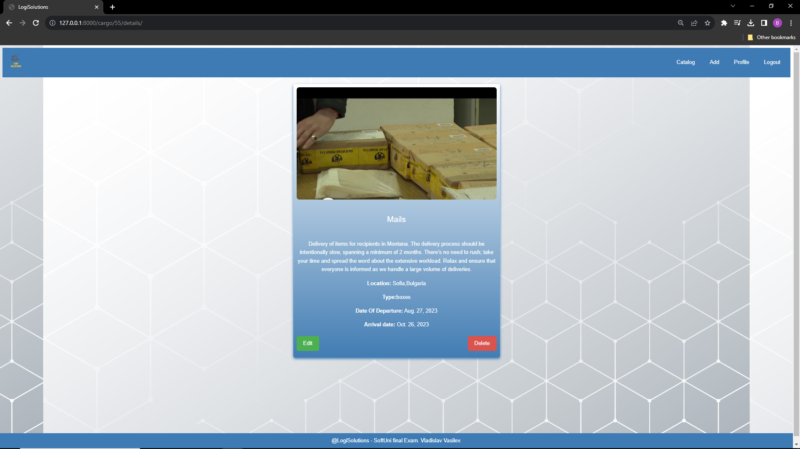
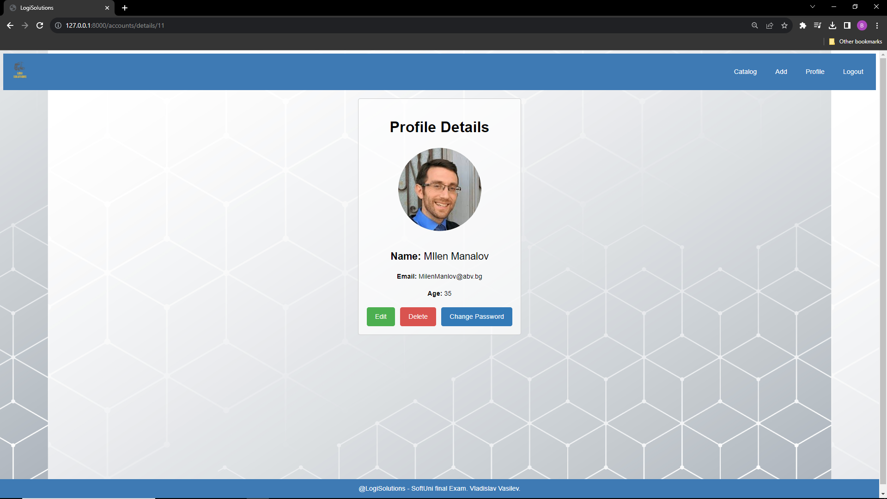
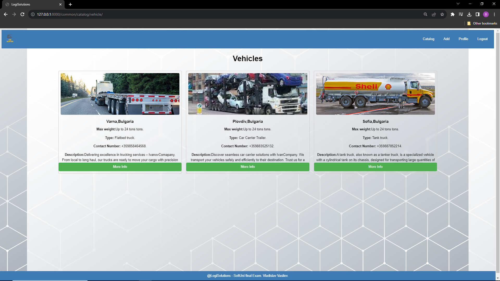
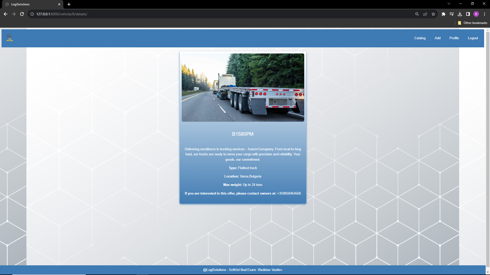
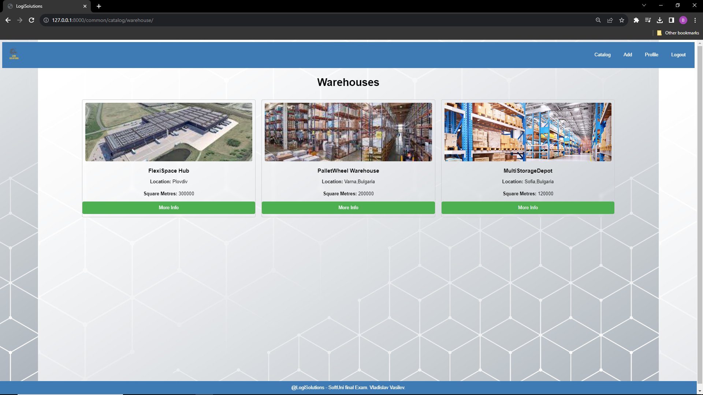

## <div align="center"> LogiSolutions </div>


## <div align="center"> Key Features </div>

<div align="center">
  <h3>Cargo and Vehicle Matching</h3>
  <p>LogiSolutions simplifies the process of finding the perfect cargo for your vehicle or the right vehicle for your cargo.</p>
</div>

<div align="center">
  <h3>Strict Admin Moderation</h3>
  <p>Enhancing security and preventing fake posts, LogiSolutions incorporates strict admin moderation. Every post made by users is subject to approval by an admin. This process guarantees the authenticity of posts and maintains the quality of listings.</p>
</div>

<div align="center">
  <h3>User Interaction and Support</h3>
  <p>Even without logging in, users can ask questions about logistics and receive expert guidance. LogiSolutions' support team is dedicated to promptly responding and offering assistance to anyone seeking information or guidance.</p>
</div>

<div align="center">
  <h3>Seamless and Secure Logistics Management</h3>
  <p>LogiSolutions redefines logistics management by combining cutting-edge technology with a user-centric design. Experience the future of streamlined logistics with a platform that ensures efficiency, security, and reliable communication throughout the supply chain.</p>
</div>

##
## <div align="center"> Installation </div>


<div align="center"> Follow these steps to set up and run the LogiSolutions Django web app on your local machine:</div>


1. **Clone the Repository:** 
   ```bash
   git clone https://github.com/Vladislav-Vasilev96/LogiSolutions.git
   
2. Change your working directory to the location where you've cloned the repository: 
   ```bash
   cd LogiSolutions
   
3. Create and Activate Virtual Environment:
   ```bash
    pip install virtualenv
    virtualenv venv
    venv\Scripts\activate      # On Windows
    source venv/bin/activate   # On macOS and Linux
   
4. Install the project dependencies:
   ```bash
   pip install -r requirements.txt
   
5. Apply necessary database migrations:
   ```bash
   python manage.py makemigrations
   python manage.py migrate

6. Create a superuser account for admin access:
   ```bash
    python manage.py createsuperuser

7. Start the Django development server:
   ```bash
    python manage.py runserver
    
8. Open a web browser and go to http://127.0.0.1:8000/ to see the LogiSolutions web app.


## <div align="center">Used Technologies</div>

<p align="center"> <a href="https://getbootstrap.com" target="_blank" rel="noreferrer">  
<a href="https://www.w3.org/html/" target="_blank" rel="noreferrer">  </a>
</a> <a href="https://www.w3schools.com/css/" target="_blank" rel="noreferrer">  </a> 
<a href="https://www.djangoproject.com/" target="_blank" rel="noreferrer">  </a>
 <a href="https://www.postgresql.org" target="_blank" rel="noreferrer">  </a> </a> <a href="https://www.python.org" target="_blank" rel="noreferrer">  </a> </p>

***

<div align="center"><b>MIT License</b></div>
<p align="center">This project is licensed under the MIT License. For more details, see <a href="LICENSE">LICENSE</a>.</p>

***

<div align="center"><b>Screenshots</b></div>

<p align="center">Here are some screenshots of the LogiSolutions web app in action:</p>


   

***

   

***

   

***

   

***

   

***

   

***

   

***

   

***

   

***

   

***

<p align="center" >Feel free to explore the features and functionalities demonstrated in these screenshots!</p>